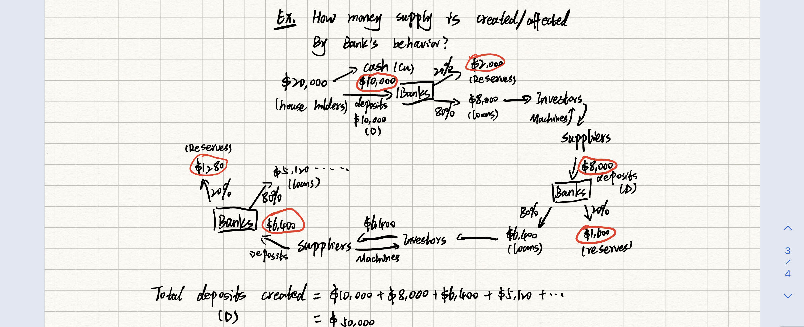

#macro

# 我的想法

Let the currency - deposit ratio be

And it is determined by the preferences of households about the form of money they wish to hold.
$$
cu=\frac{Currency}{Deposits}
$$
And the reserves-deposit ratio would be: 

And it is determined by the business policies of banks and the laws regulating banks.

$$
re=\frac{Reserves}{Deposits}
$$
Then,
$$
M=Cu+D\\=D(\frac{Cu}{D}+1) \\ =D(cu+1)
$$
And,
$$
H=Cu+Reserves=D(\frac{Cu}{D}+\frac{Re}{D})=D(cu+re)
$$
$$
mm=\frac{M}{H}=\frac{1+cu}{cu+re}>1
$$
$mm$ is the [Money Multiplier](Money%20Multiplier.md).

Ex. How money supply is created/affected by banks' behavior?
Suppose: $20,000 is divided by cash:$10,000 and deposits to banks in $10,000 (D) 

Since $M=mm*H$ and $mm>1$

So, if $H\uparrow 1\%$ ,The $M\uparrow$ more than $1\%$

Remarks:

1. As $re\downarrow,mm\uparrow$

2. As $cu\downarrow,mm\uparrow$ (reason: $cu<1$)

---

# Reference 

