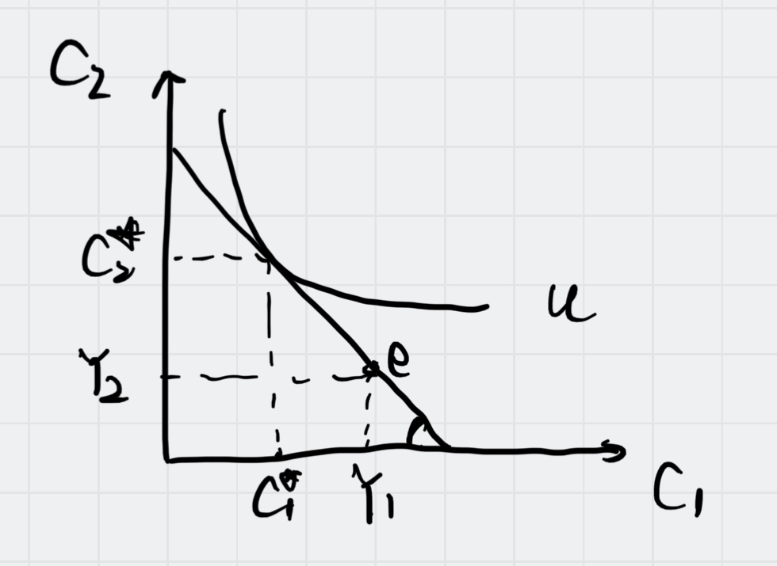

[[Consumption]]

#macro 

In this case, $e$ represent  the ==endowment== point, the value between $C^ * _1$ and $Y_1$ means $S^ * _1$ , and we can test the value to check whether a consumer is a saver or a borrower.

> Endowment point is the combination of the $Y_1$ and $Y_2$

Notice that it is no connection with the ==Tax== , so the [Endowment](Endowment.md) point may be not on the exactly the budget constraint curve.

So the problem solving process is :

1. We first test $\frac {\delta U}{\delta S}$ to find out the optimal $S^*$
2. And then we calculate the $C_1$ and $C_2$ $Y_1$ and $Y_2$ to compare, if $Y_1 > C_1$, that means the consumer is a saver, and vice versa.

### What if a person can't save (That means, there is no banks)

Then the optimal choice of would be the **endowment point**, the reason maybe there's no chance to adjust the saving plan to maximize the Utility.