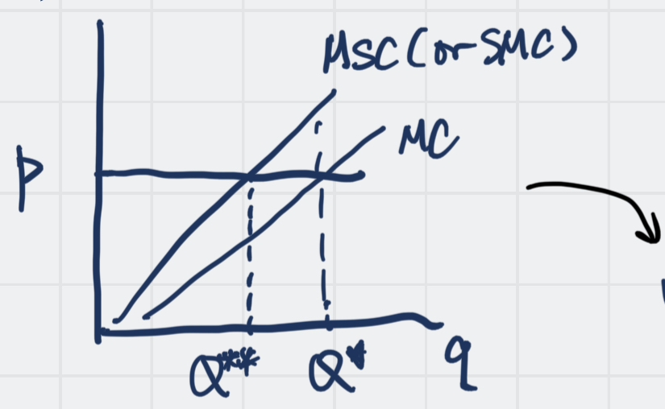

# Tell it by myself...

中文：外部性，又可以被理解为溢出效果，是由 A 对 B 产生的活动带来的对 C（第三方）的影响，就放佛车辆产生的空气污染对社会带来影响，就是一个典型的例子。它可以从一个 producer 转移到另一个 producer 里面。

如何外部问题内部化呢？著名 Professor [[Pigou]] 解决了这个问题

---

*Definition*: 
One agent’s welfare (utility or profit) *affected* directly by action of another one in the economy, it is not taken into account by the price system. And it is a kind of [[Market Failure]] 

Although the externality could be between producer and producer, producer and consumer, consumer and consumer, for convenience, we still isolate the *Producer and Producer* case, because it can analyze easier by number, to calculate the utility. (See [Utility Theory](Utility%20Theory.md))

## Some  Examples:

#### Positive Examples:

1. Provision of [[Public Goods]]
2. Education
3. Vaccination during a pandemic

*Positive Externalities means your own choice output is less than the max social benefit (which is the efficient quantities), otherwise it is a negative externalities*

Sometimes we use subsidy to improve the efficiency of *positive externalities*, while we use *taxes* to reduce the *negative externalities*

## Producer and Producer

## Pigou ways

[Pigou](Pigou.md)

MSC means [[Social Marginal Cost]]. (of course, in Marginal Social Cost) 

> It can be written as $MCS$ or $MSC$, both are correct.

It is easy to see that the $Q^{**}$ is the optimal choice for social benefit, and the difference between $MC$ and $MSC$ would be larger and larger since the $Q$ increasing.

So it is easy to conclude that the Firm A would produce too much! How to avoid this situation, let hit to be a "Good boy" ? The professor [Pigou](Pigou.md) gives  a situation and with its famous [Pigou Tax](Pigou%20Tax.md)

Question: after lead in the traditional [Monopoly](Monopoly.md) curve, will lead to another method different form [Pigou](Pigou.md)

Tax isn't always the best solution

## Only Pigou?

`2023.4.14` [Coase Theorem](Coase%20Theorem.md) leads in a different solution, which is a different idea from [[Pigou]], however, the problem is that we can't measure the exact social marginal cost directly. 

### Reference

维基： https://zh.wikipedia.org/zh-tw/%E5%A4%96%E9%83%A8%E6%80%A7

[Externalities and Public Goods](Externalities%20and%20Public%20Goods.md)

