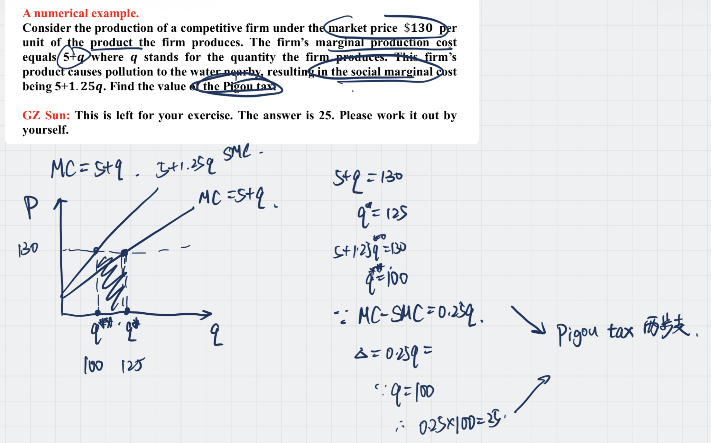

Also know as *Pigouvian tax*

#### Step to Calculate

1. 先算出对于 Society 的 optimal quantity
2. 将 $SMC$ 与 $MC$ 相减，也就是算出 $\delta$ cost 检验究竟要花多少钱来弥补
4. Then use delta cost multiply by the delta quantity, then it would be the [[Pigou Tax]]

One numerical example

## The Opposite...

Some economists disagree with [Pigou](Pigou.md), and among them the most famous one is  [[Coase]] with his [Coase Theorem](Coase%20Theorem.md).

## Adds

In the course [[ECON4008 Law and Economics]] , we develop the model a little bit.

![[截屏2023-09-26 15.20.15.png]]

---

### Reference 

