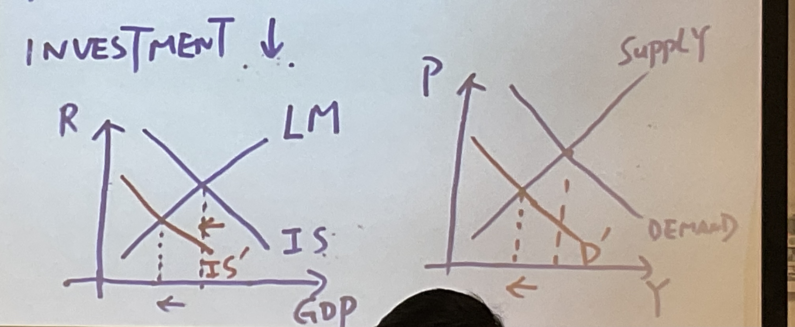

[Consumption according to Keynes](Consumption%20according%20to%20Keynes.md)

[Consumption and Investment](Consumption%20and%20Investment.md)

*一个例题*

Ex. $Y=K^{0.3}L^{0.7} ,P_K=2,P=1,r=20\%,\delta = 5\%,Y=100,K^*?$

Step: $Y=K^{0.3}L^{0.7}\rightarrow MPK=\frac{\delta Y}{\delta K}=0.3\frac{100}{K}$

When $MPK=\frac{P_K}{P}(r+\delta)$

So it is easy to calculate $K^*=60$ 

Since $K_{t+1}=(1-\delta)K_t+I_t=K_t-\delta K_t+I_t$

$\delta K_t$  refers to Depreciation of  $K_t$

$K_{t+1}-K_t+\delta K_t=I_t$

If we assume $K_{t+1}=K^*$

Then, $I^*=I_t=K^*-K_t+\delta K_t$

Lets come to the previous question. What is $I^*$

Assume: $K_t=30$,

Because: $I^*=K^*-K_t+\delta K_t=31.5$

> Why don't need to calculate the labor cost?

## The Stock Market & Tobin's q

**Stock (股票)** - it refers to shares in the ownership of cooperation.

**Stock Market (股票市场**)--- It is the market where stock are traded.

To raise funding (集资...)：

**Banks:** 

1. Bank-based (Eg. Germany)

2. Market - based (Eg. USA...)

ToBin'q = Market value (市值)of installed capital (e.g. assets of a firm)/Replacement cost of installed capital (e.g. assets of a firm)

*What is replacement cost?*

It is the price of capital if capital is purchased today!

---
Example: ABC company has $40 million assets. One million stocks are issued and the price of them is $3 per stock. Tobin's q?

$=\frac{1\ million * \$ 3}{40\ million}=0.75<1$

If Tobin's q > 1,

Managers should buy more capital

If Tobin's q < 1,

Managers should stop buying more capital. They should not replace old capital

---
If $MPK>\frac{P_K}{P}(r+\delta)$, firms make profit $\rightarrow$ The market value of the firm's stock $\uparrow$ $\rightarrow$ Tobins'q $\uparrow$
Note that if they meet a loss, the result would be negative.

---
Why stock prices and GDP move together?

Reason: When stock prices fall $\rightarrow$ Tobins'q $\downarrow$ $\rightarrow$ investors worry about the profitability $\rightarrow$ Investment $\downarrow$

2. Residential investment 

It includes the purchases of new housing who plan to live in it and by landlords who plan to rent it out.

