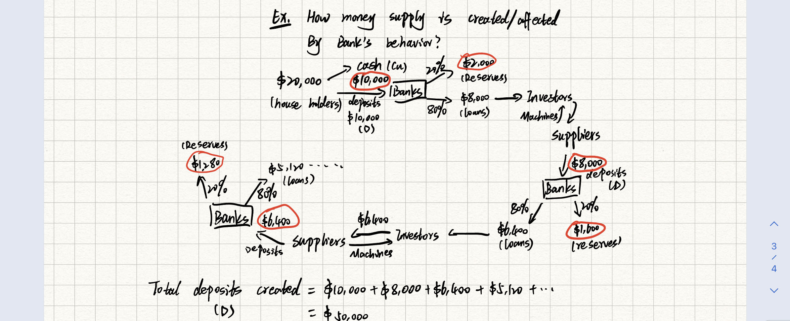
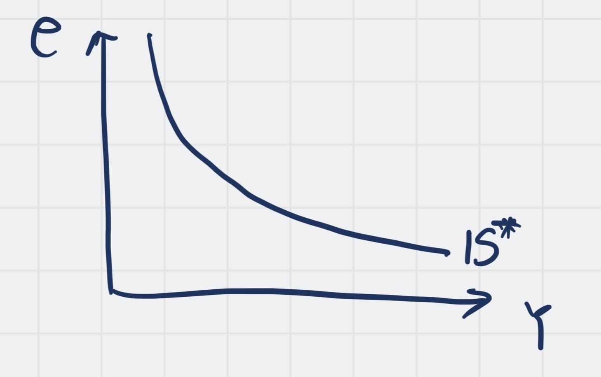

> 备注：本页已经将内容加工为原子笔记

What is money?

MOP <=> Patacas <=> 澳门币

## [[Money Functions]]

Money can fulfill 3 functions:

1. Medium of exchange

Money makes it unnecessary for "double coincidence of wants"

Becomes a barter economy ( 以物换物 )

For example, 

A sells wheat and buys potatoes

B sells oranges buys wheat

C buys oranges sells potatoes

他们三个可以使用钱来充当统一的中间媒介

There is no "Double Coincidence of wants"

2. Unit of account
3. [[Store of Value]] 

## [[Store of Value]]

$ is an asset that can make purchases to happen at  a later day

B) Components of money stock

There are 3 major monetary aggregates: M1, M2, M3

M1 consists of claims that can be used instantly, directly and without any restrictions to make purchases usually

M1 = currency +checkable deposits

Liquid 

Financial Claims are liquid when they can be used conveniently to market transactions

M2 = M1 + [[Near Monies]]

E.G saving deposits

Small time deposits (less than USD 100,000)

M3 = M2 + large time deposits (Larger than USD 100,000)

Are credit cards a part of monetary aggregate?

No. They are short-term loans

---
What is a portfolio allocation?

- Money supply ( i.e. M) consists of currency (CU) + deposits (D), So $M =CU+D$
- [[Monetary Base]] (i.e. H, also called high - powered money) consists of currency plus reserves. So $H =Currency+ Reserves$

[[Reserves]]: They are ==commercial banks' deposits at central banks== 

## [[Bank Runs]], such as 挤兑
Let the currency - deposit ratio be

And it is determined by the preferences of households about the form of money they wish to hold.
$$
cu=\frac{Currency}{Deposits}
$$
And the reserves-deposit ratio would be: 

And it is determined by the business policies of banks and the laws regulating banks.

$$
re=\frac{Reserves}{Deposits}
$$
Then,
$$
M=Cu+D\\=D(\frac{Cu}{D}+1) \\ =D(cu+1)
$$
And,
$$
H=Cu+Reserves=D(\frac{Cu}{D}+\frac{Re}{D})=D(cu+re)
$$
$$
mm=\frac{M}{H}=\frac{1+cu}{cu+re}>1
$$
$mm$ is the [Money Multiplier](Money%20Multiplier.md).

Ex. How money supply is created/affected by banks' behavior?
Suppose: $20,000 is divided by cash:$10,000 and deposits to banks in $10,000 (D) 

Since $M=mm*H$ and $mm>1$

So, if $H\uparrow 1\%$ ,The $M\uparrow$ more than $1\%$

Remarks:

1. As $re\downarrow,mm\uparrow$

2. As $cu\downarrow,mm\uparrow$ (reason: $cu<1$)

1. Open Market Operation

Suppose central banks want to increase money supply, central banks can print money and they use this new money to buy assets (e.g. Government Bonds 债券) from the public by buying assets, central banks increase money in circulation. This is ==Open market purchase==

If they want to decrease money supply, they can sell assets to the public for currencies ,this is ==Open market sale==

2. The discount rate

A bank that is short of reserves can borrow from the central bank to cover the deficiency. The cost of borrowing from central banks is discount rate

If the rate increases, banks will choose to borrow less. Then H may decreases

3. The reserve ratio central banks  can increase or decreases money supply by reducing or increasing the required reserve ratio

Note： reserves at central banks ray no interest, but Macau monetary authority does so!

- Demand for money

There exist 3 major motives behind money demand

1. The transaction demand

- It comes from the need in making regular payments

- $n$ --- The No. Of times a person goes to banks in a time period
- $i$ --- real interest rate
- $tc$ ---cost of per transaction with banks
- $Y$ ---monthly income
- $\frac{Y}{2n}$ --- average cash balance

It is the average amount of money a person keeps in a time period

$$
Total\ cost=n*tc+i\frac{Y}{2n}
$$

Total transaction costs with banks+Total interest cost

And now we want to minimize the total cost

F.O.C:

$\frac{\delta Total\ cost}{\delta n}=tc+\frac{iY}{2n^2}(-1)=0$

=> $tc=\frac{iY}{2n^2}$ so $n^ * =\sqrt\frac{iY}{2\ tc}$

$n^*$ is the optimal number of time you should go to banks in a time period

If we use $n^*$ in $M=\frac{Y}{2n}$,

$$
M^ * =\frac{Y}{2n^ * }=\frac{Y}{2}\sqrt\frac{2tc}{iY}=\sqrt\frac{tc\ Y}{2i}
$$

$M^*$ is the optimal amount of cash a person should hold arising from transaction（交易）demand for $

**Remarks:**

1. As $i\uparrow$, we find $n^* \uparrow$, $M^* \downarrow$

1. $Y \uparrow$, $n^* \uparrow$, $M^* \uparrow$

2. $tc \uparrow$, $n^* \downarrow$, $M^* \uparrow$

Ex. Y = MOP 15,000 / Month, tc = MOP 5, i =0.5%, what is n* and M*?

$$
n^* =\sqrt\frac{iY}{2\ tc}=\sqrt\frac{0.5\% * 15,000}{2*5}=2.738\approx 3\ times
\\
M^* =\frac{Y}{ 2n^* }=\frac{15000}{2\times 3}=MOP2,500
$$

> notice that the $n$ should not be decimal

2. Pre cautionary demand people hold money because they are not certain about the payment they make, other forms of wealths may not available for them to buy what they need

3. Speculative Demand（投机）-
People hold money because they think that other form of wealth may fall in value

## The [[Velocity of Money]] (v)

$v$ is the number of times that a dollar bill transfers from a person to the others in a time period.

$$
MV=PY
$$

Remarks:

$m$ - Money stock

$p$ - Output price

$Y$ - Total output

Ex. $PY = \$ 1000, M = \$ 500$

So $v=\frac{1000}{500}=2$

$$
MV=PY\\
lnM+lnV=lnP+lnY\\
\frac{\delta lnM}{\delta t}+\frac{\delta lnV}{\delta t}=\frac{\delta lnP}{\delta t}+\frac{\delta lnY}{\delta t}\\
\frac{\Delta M}{M}+\frac{\Delta V}{V}=\frac{\Delta Y}{Y}+\frac{\Delta P}{P}\\
notice\ that\ if\ v\ and\ Y\ are\ contant, \frac{\Delta V}{V}=0,\frac{\Delta Y}{Y}=0\\
\frac{\Delta M}{M}=\frac{\Delta P}{P}\\
$$

If $M\uparrow 1\%,P\uparrow 1\%$

[[Inflation]] is a ==monetary phenomenon==!

- Why government prints money?

Because they use new money to pay back debts

A high level of inflation (usually 50% or more per month) It is usually caused by Government printing a lot of money

We extend this [[IS-LM model]] to include international trade and finance

This [[Mundell-Fleming Model]] makes a very important assumption: *This economy being studied is a [[Small Open Economy]]* with perfect capital mobility.

Lesson: The behavior of a small open economy depends on its exchange rate system.

There are 2 major kinds of exchange rate:

1. Floating Exchange Rate
2. Fixed Exchange Rate, Eg: 1 USD = 8 MOP

## The [Mundell-Fleming Model](Mundell-Fleming%20Model.md) under floating exchange rate system

In a [Small Open Economy](Small%20Open%20Economy.md) with perfect capital mobility, the domestic interest rate ($r$) is decided by the world interest rate ($r^{* }$) , that is, $r=r^{* }$ where $r^{* }$ is exogenously fixed

If $r<r^{*}$, the [Small Open Economy](Small%20Open%20Economy.md) will experience [[Capital Outflow]]

If $r>r^{*}$, the [Small Open Economy](Small%20Open%20Economy.md) will experience [[Capital Inflow]]

When either one of these 2 cases happen, international capital flows are rapid enough to maintain:  $r=r^{*}$ 

## IS Curve

Now, $Y=C+I+G+NX$

$=C(Y-T)+I(r)+G+NX(e)$

Where, $NX=export - import$, $e$ is the real exchange rate, and $\frac{\delta I}{\delta r}<0$, $\frac{\delta NX}{\delta e}<0$

### Example:

$e=100 RMB/USD$

If $e \uparrow$ to $120 RMB/USD$, that means the USD is getting stronger (变得更值钱)

=> In US, $EX$ will grow down, $IM$ will grow up

=> In US, $NX(EX-IM) \downarrow$

When $r=r^{*}$, the IS curve becomes:

$=C(Y-T)+I(r^{* })+G+NX(e)$ , which denotes as IS* curve.

## The LM curve

$\frac{M}{P}=L(r,Y)$,with $\frac{\delta L}{\delta r}<0$ and $\frac{\delta L}{\delta Y}>0$

P and M are exogenous given

Since this is a [Small Open Economy](Small%20Open%20Economy.md) , In a [Small Open Economy](Small%20Open%20Economy.md) with perfect capital mobility, the **domestic interest rate**(该经济里的利率) ($r$) is decided by the **world interest rate** ($r^{* }$) , that is, $r=r^{* }$ where $r^{* }$ is exogenously fixed.

$\frac{M}{P}=L(r^{* },Y)$   

- But why the $LM$ curve is vertical?

The reasons could be the $r^{* }$ is fixed. 

$Y=C(Y-T)+I(r^{* }) +G +NX(e)$

$\frac{M}{P}=L(r^{* },Y)$

Ex: $C= 800+0.6(Y-T)$

$I = 300 - 60r,G=540,T=500$

$Nx = 500 - 100e$

$\frac{M}{P} = y-75r, M = 500,  P  = 4$

$r^{* } = 6$

So , we can write down the $IS^{* }$ curve:

$Y=C(Y-T)+I(r^{* }) +G +NX(e)$

$Y= 800+0.6(Y-500)+300 - 6 * 6 + 540+500 - 100e$

$Y = 3700 - 250e$

Then about the $LM^{* }$ curve:

$\frac{M}{P} = Y - 75r$

$Y^{* }=57.5$

$e^{* } = 12.5$

Note that point E is the equilibrium,  now we consider 3 policies:

1. Fiscal policy

Suppose that our government increase the government purchase, this policy shifts $IS^{* }$ to right! Notice the difference to the **Close-Economy case**!

As a result, the exchange rate appreciates but total income stays the same. Why? 

#### Explanation :

As $G \uparrow$ $IS$ shifts to the right, and $Y$ would increase , and in the $LM$ curve, the money demand would increase $\rightarrow$ in order to restore money market equilibrium, $r \uparrow \rightarrow r > r^{* }\rightarrow$ *capital inflows* $\rightarrow$ They push $r$ back to $r^{* }$ $\rightarrow$ at time, the same foreign investors need to use domestic currency to invest in domestic economy   

Demand for domestic currency $\uparrow \rightarrow$ Domestic currency appreciates  $\rightarrow$ import increases, export decreases, $NX$ decreases. $\rightarrow$ $Y \downarrow$

==So, the fall in $NX$ offsets（抵消、补偿） the fiscal policy effect! $\rightarrow$ $Y$ stays the same ==

2. Monetary policy

Central banks $\uparrow$ money supply it means $\uparrow$ in real money balance (i.e. $\frac{M}{P}$) where $P$ is fixed. Then $LM^{* }$ curve moves to right!

#### Explanation :

As $\frac{M}{P} \uparrow$ $\rightarrow$ Money supply > Money demand $\rightarrow$ $r \downarrow$ $\rightarrow$ then, $r<r^{* }$  $\rightarrow$ capital outflows $\rightarrow$ they push $r$ back to $r^{* }$ $\rightarrow$ at the same time, investing outside required connecting domestic currency into foreign currency $\rightarrow$ The supply of domestic currency $\rightarrow$ the value of domestic currency must depreciate $\rightarrow$ Export increases , Import decreases $\rightarrow$ $NX \uparrow$

3. Trade policy 

The government reduces the demand for imported goods by imposting a tariff ( 关税 ) 

Since $Nx = EX - IM$, As $IM \downarrow$ due to tariffs, $NX \uparrow$ when $NX \uparrow$ $IS^{* }$ curve moves to the right

#### Explanation

As import $\downarrow$ $\rightarrow$ $NX \uparrow$ $\rightarrow$ $Y \uparrow$ $\rightarrow$ Money demand  $\uparrow$ $\rightarrow$ $r \uparrow$ and $r>r^{* }$ $\rightarrow$ capital inflows $\rightarrow$ they push $r$ back to $r^{* }$ $\rightarrow$ at the same time, demand for domestic currency $\uparrow$ 

$\rightarrow$ Domestic currency increases in value $\rightarrow$ $EX$ decreases, $IM$ increases.

$\rightarrow$ $NX$ increases $\rightarrow$ $Y$ goes back to its original level!

